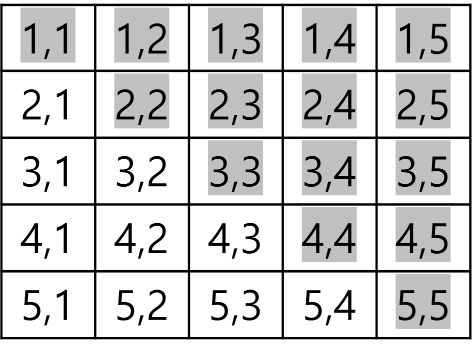
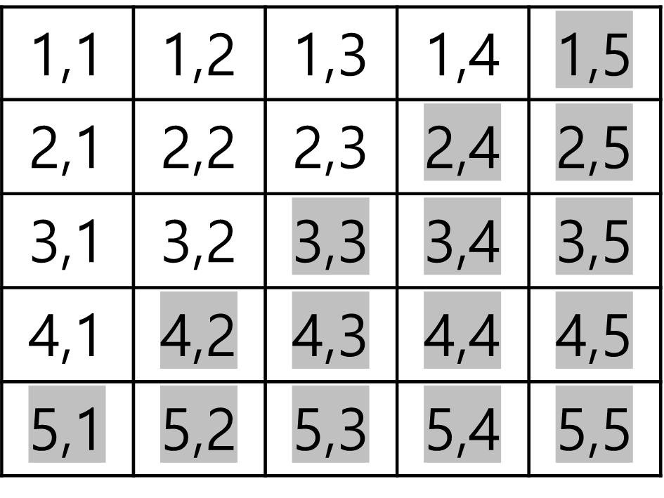

##  📢 시작하기

---
#### 직각 삼각형 별찍기..

***

``` java
    /**
     * 왼쪽 아래가 직각인 이등변 삼각형 출력
     */
    static void triangle1(int n) {
        for (int i = 1; i <= n; i++) {
            for (int j = 1; j <= i; j++) {
                System.out.print("*");
            }
            System.out.println();
        }
    }

    /**
     * 왼쪽 위가 직각인 이등변 삼각형 출력
     */
    static void triangle2(int n) {
        for (int i = 1; i <= n; i++) {
            for (int j = n; j >= i; j--) {
                System.out.print("*");
            }
            System.out.println();
        }
    }
```
<br/><br/>

``` java
    /**
     * 오른쪽 위가 직각인 이등변 삼각형 출력
     */
    static void triangle3(int n) {
        for (int i = 1; i <= n; i++) {
            for (int j = 1; j <= n; j++) {
                System.out.print(i<= j ? "*" : " ");
            }
            System.out.println();
        }
    }
```


<br/>
i, j에서 i가 j보다 작거나 같을 때 출력되는 패턴.
위 조건 충족할 시 '*' 출력.
<br/><br/><br/>

``` java
    /**
     * 오른쪽 아래가 직각인 이등변 삼각형 출력
     */
    static void triangle4(int n) {
        //        for (int i = 1; i <= n; i++) {
        //            for (int j = n; j >= 1; j--) {
        //              System.out.print(i >= j ? "*" : " "); 
        //            }
        //            System.out.println();
        //        }
        for (int i = 1; i <= n; i++) {
            for (int j = 1; j <= n; j++) {
                System.out.print(i+j > n ? "*" : " ");
            }
            System.out.println();
        }
    }
```
  
<br/>
i, j에서 i+j의 값이 n보다 클 경우 출력되는 패턴
위 조건 충족할 시 '*' 출력.
<br/><br/><br/>